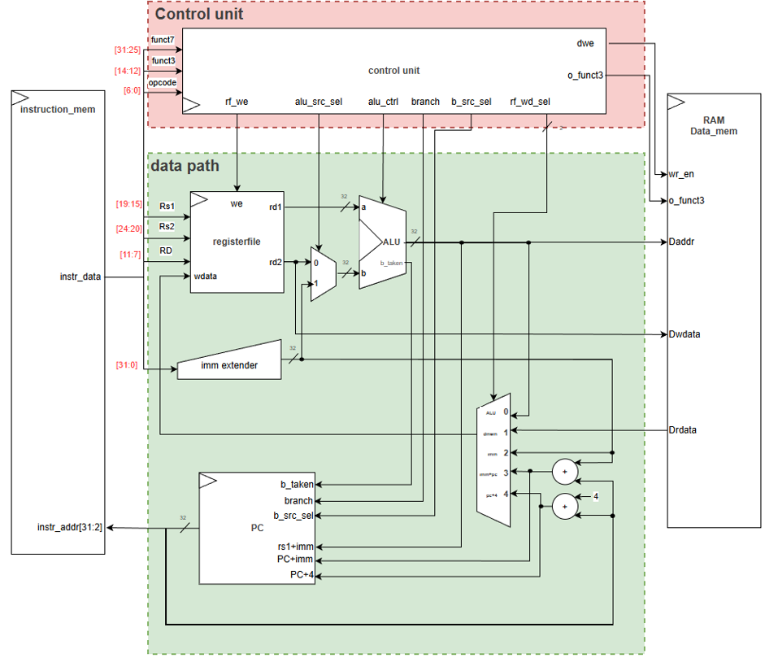
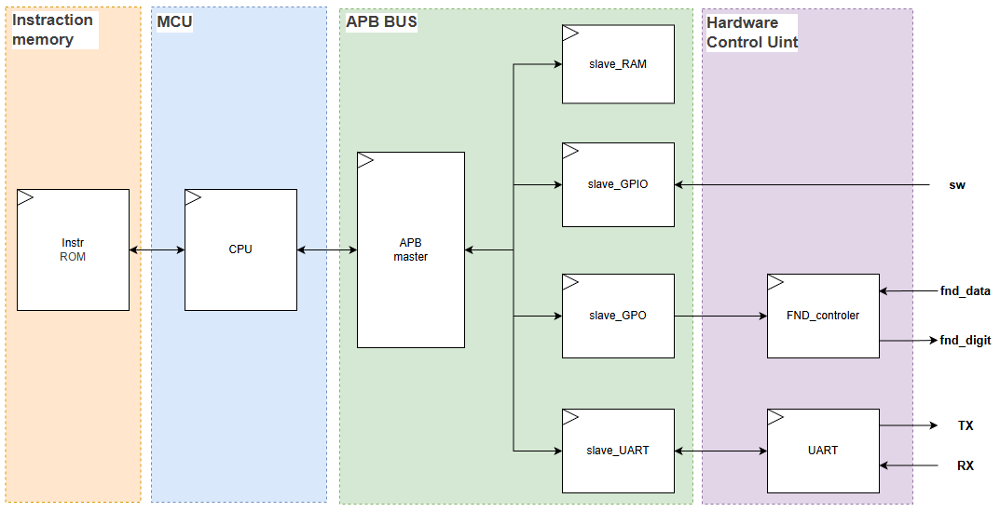

# 📄 [Project] RISC-V RV32I Processor & MCU Design
> **ISA의 완벽한 이해부터 APB Bus 기반 MCU 설계 및 Basys3 FPGA 실물 검증까지**

  
  
  
  

## 🎯 Project Overview
본 프로젝트는 **RISC-V(RV32I) ISA**를 기반으로 프로세서의 핵심 설계와 시스템 확장 능력을 증명한 하드웨어 설계 프로젝트입니다. 
- **개인 프로젝트:** Single-cycle CPU 설계를 통한 **명령어 세트(ISA)** 전수 검증
- **팀 프로젝트:** Multi-cycle CPU 기반의 **APB Bus SoC** 설계 및 Basys3 FPGA 시스템 구현

---

## 📊 Design Comparison
| 구분 | 🛠 Single-cycle (Individual) | 🚀 Multi-cycle MCU (Team) |
| :--- | :--- | :--- |
| **핵심 목표** | ISA 동작 원리 및 데이터패스 이해 | 시스템 확장 및 주변장치 제어(SoC) |
| **Architecture** | RV32I Single-cycle CPU | Multi-cycle CPU 기반 MCU |
| **Language** | **SystemVerilog** | **SystemVerilog** |
| **Bus Protocol** | N/A (Internal Bus) | **APB (Advanced Peripheral Bus)** |
| **주요 성과** | 명령어 전수 검증 & 누적 Sum 구동 | **Up-Down Game** 실물 시스템 구현 |

---

## 🛠 1. Single-cycle Processor: ISA Deep Dive
**"하드웨어 레벨의 명령어 처리 및 제어 로직 최적화"**

* **Instruction Coverage:** R/I/S/B/U/J 모든 타입의 단일 명령어를 시뮬레이션을 통해 전수 검증 완료.
* **Program Execution:** ROM에 **누적 합(1 to N Summation)** 프로그램을 적재하여 데이터패스의 정합성 증명.

  

---

## 🛠 2. Multi-cycle MCU: System Integration
**"산업 표준 버스를 활용한 확장 가능한 아키텍처 설계"**

### 🏗 System Architecture & Bus
* **Standardization:** **SystemVerilog Interface**를 활용하여 APB Bus 프로토콜 신호 규격 정의 및 모듈 간 연결 복잡도 감소.
* **Address Map:** **MMIO** 설계를 통해 메모리, GPIO, GPO, UART를 동일한 주소 공간에서 제어.
* **Control Unit:** FSM(Finite State Machine) 기반의 효율적인 멀티 사이클 제어 로직 구현.

### 🎮 Basys3 FPGA Implementation
> **'Up/Down Game' 실물 시스템 구동**
* **Input:** Push Buttons (Reset), Slide Switches (사용자 입력), UART (정답 입력 설정 및 추리한 정답 확인)
* **Output:** 7-Segment Display (UP / DOWN / 정답 상태 시각화)

  

---

### 🤝 Technical Challenges & Troubleshooting
**"Implementation 단계의 Timing Closure 달성"**

* **WNS(Worst Negative Slack) 해결:** 
    * **Issue:** 합성과 배치 배선(Implementation) 과정에서 **WNS가 음수(-)**로 발생하는 타이밍 위반 문제 직면.
    * **Solution:** Critical Path 분석을 통해 조합 회로의 논리 깊이를 최적화하고, 데이터패스 중간에 **Register를 삽입(Pipelining)**하여 타이밍 마진을 확보함으로써 최종 Timing Closure 달성.