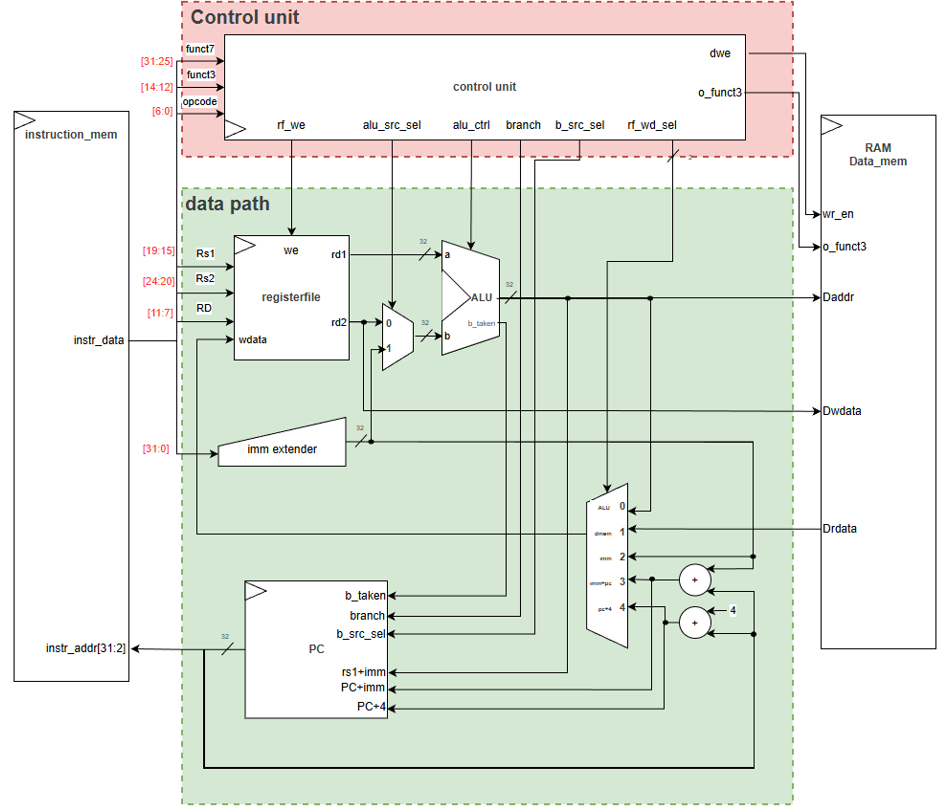

# 🚀 RISC-V (RV32I) CPU 설계 및 시뮬레이션

## 📌 개요
본 프로젝트는 오픈 소스 명령어 집합 아키텍처(ISA)인 RISC-V를 기반으로, 최소한의 필수 명령어만 유지하는 RV32I 규격의 코어(CPU)를 직접 설계하고 동작을 검증한 결과물입니다. 데이터 메모리와 명령어 메모리가 분리되어 저장되는 하버드(Harvard) 아키텍처를 채택하였으며, 32비트 고정 길이의 명령어 구조와 32개의 레지스터 파일로 구성되어 있습니다.

## 🛠️ 하드웨어 아키텍처 (Block Diagram)

시스템은 제어를 담당하는 Control Unit과 실제 연산 및 데이터 흐름을 담당하는 Data Path 모듈들로 세분화되어 설계되었습니다.

* **Instruction Mem (ROM):** 시스템이 실행할 명령어가 저장되는 메모리입니다.
* **Control Unit:** 명령어의 Opcode 등을 분석하여 전체적인 시스템의 동작을 제어합니다.
* **Register File:** ALU 연산을 위한 데이터를 제공하고 저장하는 레지스터 공간입니다.
* **Imm Extender:** 명령어에 포함된 상수를 32비트 상수로 확장(변환)합니다.
* **ALU:** 산술/논리 연산을 처리하며 분기(Branch)를 위한 조건을 확인합니다.
* **PC (Program Counter):** Instruction 메모리가 읽어들일 다음 주소를 지정합니다.
* **DATA Memory (RAM):** Load 및 Store 연산을 통해 데이터를 읽고 쓰는 워드 단위(Word Addressing) 메모리입니다.

## 💻 지원 명령어 (Instruction Set)
프로세서는 총 7가지 Type의 동작 방식을 통해 다양한 명령어를 처리합니다.

| 명령어 타입 (Type) | 동작 설명 (Description)                                                                                       | 지원 명령어 (Instructions)                                             |
| :----------------- | :------------------------------------------------------------------------------------------------------------ | :--------------------------------------------------------------------- |
| **R-type**         | Rs1, Rs2 레지스터의 값을 산술 및 논리 연산하는 명령어입니다.                                                  | `ADD`, `SUB`, `SLL`, `SLT`, `SLTU`, `XOR`, `SRL`, `SRA`, `OR`, `AND`   |
| **I-type**         | Rs1 레지스터와 상수(Immediate) 값을 산술 연산하는 명령어입니다.                                               | `ADDI`, `SLLI`, `SLTI`, `SLTUI`, `XORI`, `SRLI`, `SRAI`, `ORI`, `ANDI` |
| **S-type**         | 레지스터의 특정 값을 데이터 메모리(Dmem)에 저장(Store)하는 명령어입니다.                                      | `SB`, `SH`, `SW`                                                       |
| **IL-type**        | 기능적 분리를 위해 I-type에서 분리되었으며, 데이터 메모리의 값을 레지스터로 읽어오는 로드(Load) 명령어입니다. | `LB`, `LH`, `LW`, `LBU`, `LHU`                                         |
| **B-type**         | 레지스터 간 비교 연산 후, 조건이 참일 경우 지정된 상대 주소로 분기(Jump)하는 명령어입니다.                    | `BEQ`, `BNE`, `BLT`, `BGE`, `BLTU`, `BGEU`                             |
| **U-type**         | 32비트 상수 로드(`LUI`) 및 현재 PC 기준 상대 주소 연산(`AUIPC`) 명령어입니다.                                 | `LUI`, `AUIPC`                                                         |
| **J-type**         | 무조건 지정된 주소로 프로그램 흐름을 점프시키는 명령어입니다.                                                 | `JAL`, `JALR`                                                          |

## 🔍 검증 및 시뮬레이션 (Simulation)
설계된 프로세서의 정상 동작을 검증하기 위해 C 코드로 작성된 '누적 Sum 프로그램'을 어셈블리어로 변환하여 시뮬레이션을 진행했습니다.
* **검증 방식:** `While` 반복문과 `Adder` 함수를 구현하여 레지스터 내부 데이터 흐름 관찰.
* **분석 포인트:** 함수 호출에 따른 스택 포인터(SP) 공간 확보 과정, 매개변수(A, B 인자) 전달, 서브루틴 연산 완료 후 Return 주소로의 정상 복귀 및 SP, S0 레지스터 반납 과정 분석.

## 💡 Trouble Shooting
* **Issue:** 누적 Sum 프로그램을 어셈블리 코드로 검증하는 과정에서, 함수 호출 시 새롭게 할당되는 스택(Stack) 공간의 구조와 레지스터, 데이터 메모리의 유기적인 쓰임새를 파악하는 데 어려움을 겪었습니다.
* **Solution:** 명령어 하나하나에 따른 Data Flow(데이터 흐름)를 여러 차례 집중적으로 분석했습니다. 이 과정을 통해 함수 호출과 레지스터 활용 방식에 숨겨진 규칙성을 파악할 수 있었으며, 전체 어셈블리어 구조의 동작 메커니즘을 온전히 이해할 수 있었습니다.